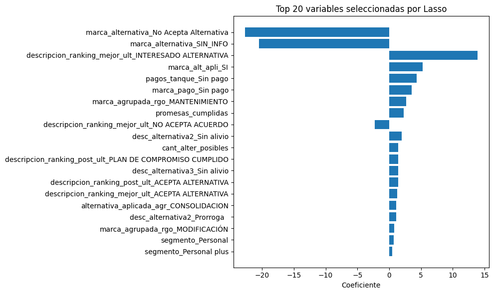

# 🧠 Modelo de Propensión a la Aceptación de Opciones de Pago - Bancolombia

## 📌 Descripción General

Este proyecto responde a un reto técnico de Bancolombia que busca anticipar si un cliente en mora aceptará una opción de pago preaprobada en el siguiente mes de gestión. Actualmente, estas decisiones se toman sin considerar la probabilidad de aceptación, lo que puede generar ineficiencias operativas y mayores costos de recuperación.

El objetivo es desarrollar una solución analítica E2E capaz de predecir dicha aceptación, integrando esta probabilidad como una variable adicional dentro del sistema de priorización actual del banco.

## 🎯 Objetivo del Modelo

Predecir la variable binaria `var_rpta_alt`, que indica si un cliente aceptó (1) o no (0) una opción de pago preaprobada durante el siguiente mes, con base en datos históricos de comportamiento, gestión y características de la deuda.

El modelo será evaluado sobre una muestra fuera de tiempo (enero 2024) utilizando **F1 Score** como métrica principal.

## 🧩 Enfoque General

Se construyó una solución completa que abarca:

- Limpieza y transformación de datos
- Ingeniería de características
- Entrenamiento y validación de modelos de clasificación
- Evaluación robusta con muestra out-of-time
- Preparación de artefactos para inferencia y consumo productivo
- Propuesta teórica de arquitectura para MLOps y despliegue

Toda la solución fue desarrollada exclusivamente con los datos entregados y siguiendo criterios de buenas prácticas en ciencia de datos y aprendizaje automático.

## Data Engineering

### 🔍 Limpieza de variables 

Se analizaron las variables numéricas mediante boxplots para detectar outliers, asimetrías y problemas de escala. Los principales hallazgos fueron:

- Muchas variables presentan **outliers extremos** y **alta asimetría**, especialmente las relacionadas con monto (`vr_obligacion`, `saldo_capital`, `pago_total`) y mora (`dias_mora_fin`, `max_mora`).
- Algunas variables como `porc_pago`, `cant_gestiones` y `promesas_cumplidas` tienen distribuciones sesgadas y valores atípicos frecuentes.
- Las variables probabilísticas (`prob_propension`, `prob_auto_cura`, etc.) están bien escaladas, pero se evaluará su uso para evitar **data leakage**.

### 🛠 Transformaciones aplicadas

Para mitigar estos problemas, se aplicó una función de tratamiento automático de variables numéricas que incluye:

- **Imputación de nulos** con la mediana.
- **Transformación logarítmica (`log1p`)** para variables con alta asimetría.
- **Winsorización al 1% y 99%** para reducir el impacto de valores extremos.

Estas transformaciones permiten estabilizar la varianza y mejorar la robustez del modelo frente a datos atípicos.

El proceso completo de limpieza y transformación está implementado en la clase [`FeatureSelector`](src\data_engineer.py), que automatiza el tratamiento numérico, escalamiento, codificación categórica y reconstrucción del dataset final con las variables seleccionadas.

## 📊 Análisis exploratorio (EDA)

Durante el EDA se exploró la variable objetivo y su relación con varias variables categóricas. Se utilizó la prueba de **Chi-cuadrado** para evaluar si existía una asociación significativa entre estas variables y la variable objetivo `var_rpta_alt`.

### 🧪 ¿Qué es la prueba de Chi-cuadrado?

La prueba de **Chi-cuadrado de independencia** permite evaluar si dos variables categóricas están asociadas. En este caso, se analiza si la distribución de una variable categórica cambia significativamente entre las clases 0 y 1 de la variable objetivo. Un **p-valor < 0.05** indica que existe una asociación estadísticamente significativa.

---

### 🎯 Variable objetivo (`var_rpta_alt`)
- **Distribución**: La variable objetivo está **relativamente balanceada**.
  - Clase 0: 53.2%
  - Clase 1: 46.8%
- Esto facilita el entrenamiento de modelos sin requerir técnicas avanzadas de balanceo.

---

### 🔹 `banca`
- **Cardinalidad**: 3 categorías.
- **Resultado del test Chi²**: p-valor = 0.0000 → **asociación significativa**.
- **Interpretación**:
  - La aceptación de opciones de pago varía según el tipo de banca.
  - "Banca Personas" domina en volumen, pero "Independientes" y "Pyme" tienen patrones diferentes por clase.

---

### 🔹 `rango_mora`
- **Cardinalidad**: 2 rangos: `1-30` y `31-90` días.
- **Resultado del test Chi²**: p-valor = 0.0003 → **asociación significativa**.
- **Interpretación**:
  - Los clientes con menos días en mora (`1-30`) tienen mayor proporción de aceptación de opciones de pago.

---

### 🔹 `alternativa_aplicada_agr`
- **Cardinalidad**: 7 categorías.
- **Resultado del test Chi²**: p-valor = 0.0000 → **asociación significativa**.
- **Interpretación**:
  - Las alternativas aplicadas previamente tienen fuerte influencia sobre la aceptación actual.
  - Destaca `SIN_INFO` con mayor proporción de clase 0.

---

### 🔹 `cant_promesas_cumplidas_binario`
- **Cardinalidad**: binaria.
- **Resultado del test Chi²**: p-valor = 0.0000 → **asociación significativa**.
- **Interpretación**:
  - Los clientes que **han cumplido promesas de pago** anteriormente son más propensos a aceptar nuevas opciones.

---

### 🔹 `cant_gestiones_binario`
- **Cardinalidad**: binaria.
- **Resultado del test Chi²**: p-valor = 0.0000 → **asociación significativa**.
- **Interpretación**:
  - Las obligaciones con al menos una gestión previa tienen una mayor proporción de aceptación.

---

### 🔹 `segmento`
- **Cardinalidad**: 6 categorías.
- **Resultado del test Chi²**: p-valor = 0.0000 → **asociación significativa**.
- **Interpretación**:
  - Hay diferencias claras entre segmentos. El segmento "Personal" agrupa la mayoría de los datos, pero los patrones de aceptación varían por segmento.

---

### 🔹 `marca_alternativa`
- **Cardinalidad**: 3 categorías.
- **Resultado del test Chi²**: p-valor = 0.0000 → **asociación significativa**.
- **Interpretación**:
  - Los clientes con marca "Acepta Alternativa" tienen muy alta probabilidad de aceptar la opción en el mes siguiente.
  - Podría implicar **fuga de información** si esta variable es generada con posterioridad.

---

## 📈 Relación entre variables numéricas y la variable objetivo

Se utilizaron gráficos de dispersión con **jitter** para explorar cómo se comportan ciertas variables numéricas clave frente a la variable objetivo `var_rpta_alt`.

---

### 🔹 `porc_pago_mes`
- **Descripción**: Representa el porcentaje de la cuota mensual que el cliente alcanzó a pagar.
- **Hallazgos**:
  - Se observa una clara concentración de aceptación (`var_rpta_alt = 1`) en clientes con valores cercanos a 1.
  - Aquellos que pagaron más proporcionalmente tienden a aceptar las opciones de pago.
  - Esta variable podría tener una **relación positiva** con la probabilidad de aceptación.

---

### 🔹 `rpc` (¿realizó pago completo?)
- **Descripción**: Variable binaria (0 o 1) que indica si el cliente pagó completamente.
- **Hallazgos**:
  - La clase 1 de `rpc` (sí pagó completamente) se asocia fuertemente con aceptación (`var_rpta_alt = 1`).
  - Es un **predictor fuerte y directo**, aunque se debe evaluar su generación para evitar **data leakage**.

---

### 🔹 `endeudamiento`
- **Descripción**: Representa el total de obligaciones financieras del cliente.
- **Hallazgos**:
  - La mayoría de los clientes aceptan opciones cuando el endeudamiento es **relativamente bajo (< 0.4e9)**.
  - A medida que el endeudamiento aumenta, la proporción de aceptación disminuye.
  - Posible **relación no lineal** con la respuesta.

---

### 🔹 `dias_mora_fin`
- **Descripción**: Días que lleva el cliente en mora al final del mes observado.
- **Hallazgos**:
  - Clientes con menos días de mora muestran mayor probabilidad de aceptar opciones.
  - A medida que se acumulan más días, la aceptación disminuye notablemente.
  - Comportamiento esperado: los deudas recientes son más rescatables.

## 🔗 Análisis multivariado

Se realizó una matriz de correlación de Pearson para identificar relaciones lineales entre variables numéricas, lo que permite detectar:

- Variables altamente correlacionadas (redundantes).
- Potenciales candidatos para reducción de dimensionalidad o eliminación por colinealidad.

---

### 🧮 Hallazgos clave

#### ✅ Alta correlación positiva (r > 0.85)
- `valor_cuota_mes` ↔ `valor_cuota_mes_pago` (r ≈ 1.00)
- `var_rpta_alt` ↔ `var_rpta_alt_jitter` (r ≈ 0.99) → duplicada por diseño.
- `saldo_capital` ↔ `vr_obligacion` (r ≈ 0.99)
- `cant_promesas_cumplidas_binario` ↔ `promesas_cumplidas` (r ≈ 0.91)
- `fecha_pago_maxima` ↔ `fecha_pago_minima` (r ≈ 0.90)
- `valor_cuota_mes_pago` ↔ `vr_vencido` (r ≈ 0.87)
- `pago_total_log` ↔ `porc_pago_cuota` (r ≈ 0.87)
- `saldo_capital_log` ↔ `vr_obligacion_log` (r ≈ 0.86)
- `cant_acuerdo` ↔ `cant_acuerdo_binario` (r ≈ 0.77)
- `dias_mora_fin` ↔ `max_mora` (r ≈ 0.77)

Estas variables presentan **alta redundancia**. En la etapa de selección de características se considerará:
- Eliminar una de las variables correlacionadas.
- Agrupar o transformar (e.g. PCA si fuera necesario, aunque no es lo ideal aquí por interpretabilidad).

#### 🚨 Correlaciones negativas destacadas
- `min_mora` ↔ `prob_propension` (r ≈ -0.81)
- `max_mora` ↔ `prob_propension` (r ≈ -0.83)
- `num_oblig_enmascarado` ↔ `num_oblig_orig_enmascarado` (r ≈ -0.99)

Estas correlaciones indican relaciones inversas que podrían tener **valor predictivo**, especialmente en el caso de mora vs. propensión de pago.

## 🧪 Feature Selection

Para optimizar el conjunto de variables y mejorar la capacidad predictiva del modelo, se implementó un proceso sistemático de selección de características que abarcó las siguientes etapas:

---

### 🔹 1. Carga y limpieza de datos

Se cargó el dataset final (`df_master_clean.csv`) y se alineó con la base de entrenamiento (`prueba_op_base_pivot_var_rpta_alt_enmascarado_trtest.csv`), manteniendo solo las columnas comunes y excluyendo variables no informativas como `tipo_var_rpta_alt`.

---

### 🔹 2. Preprocesamiento

Se utilizó un `ColumnTransformer` para aplicar:

- `StandardScaler` a variables numéricas.
- `OneHotEncoder` (con `drop='first'`) a variables categóricas.

Esto generó un total de **218 variables transformadas** listas para modelado.

---

### 🔹 3. Eliminación de colinealidad

Se calculó la matriz de correlación absoluta y se eliminaron variables con **correlación mayor a 0.90** respecto a otras variables.  
Esto redujo el espacio de variables de **218 a 149 columnas**, mitigando redundancia y riesgo de sobreajuste.

---

### 🔹 4. Selección de variables con Lasso

Se entrenó un modelo de regresión logística con penalización L1 (`Lasso`) para seleccionar únicamente las variables con coeficientes distintos de cero.  
Este método actúa como filtro automático, priorizando las variables más relevantes.

- Total variables seleccionadas: **44 de 149**.
- El modelo identifica las variables más relevantes de forma robusta al ruido y a la multicolinealidad.

> 📊 A continuación se visualizan las **Top 20 variables seleccionadas por Lasso**, ordenadas por la magnitud del coeficiente:

---

### ✅ 5. Exportación final

Se generó el archivo final `df_procesed.csv` con las siguientes columnas:
- `id` (identificador único)
- `var_rpta_alt` (variable objetivo)
- Las **44 variables seleccionadas por Lasso**

También se exportó el listado de variables seleccionadas a [`features.csv`](./data/procesed/features.csv) para su posterior uso en inferencia o despliegue.

---

Este proceso asegura un conjunto de variables más compacto, relevante y con menor riesgo de overfitting, listo para ser usado en el pipeline de entrenamiento y producción del modelo.

## 🤖 Selección de Modelo (Model Selection)

Se evaluaron múltiples algoritmos de clasificación para predecir la variable binaria `var_rpta_alt` (acepta o no una opción de pago). El objetivo fue encontrar el modelo con mejor desempeño, validado tanto por métricas estándar como por estabilidad en validación cruzada.

---

### 🧪 Modelos evaluados

Se compararon cuatro modelos clásicos de clasificación utilizando un split 60/40 y validación cruzada (`cv=5`):

- `LogisticRegression`
- `KNeighborsClassifier`
- `DecisionTreeClassifier`
- `RandomForestClassifier`

El proceso se automatizó e integró con **MLflow**, permitiendo trazabilidad completa de cada experimento: parámetros, métricas y artefactos del modelo.

---

### ⚙️ Pipeline de evaluación

1. **Transformación del dataset** usando la clase `FeatureSelector`.
2. **Separación** en conjuntos de entrenamiento (60%) y prueba (40%).
3. Entrenamiento + validación cruzada para cada modelo.
4. Cálculo de métricas: `F1 Score`, `Precision`, `Recall`, `Matriz de Confusión`, y `Classification Report`.
5. Registro de resultados en MLflow.

---

### 📊 Resultados

| Modelo                  | F1 Score (test) | Precision | Recall | F1 CV Mean ± Std |
|------------------------|----------------|-----------|--------|------------------|
| Logistic Regression     | 0.9864         | 0.9870    | 0.9870 | 0.9867 ± 0.0005   |
| K-Nearest Neighbors     | 0.9828         | 0.9836    | 0.9836 | 0.9818 ± 0.0004   |
| Decision Tree           | 0.9906         | 0.9910    | 0.9910 | 0.9900 ± 0.0004   |
| **Random Forest**       | **0.9946**     | **0.9949**| **0.9949** | **0.9947 ± 0.0004** |

> ✅ El mejor modelo fue **Random Forest**, con un F1 score de 0.9946 y métricas muy cercanas al óptimo, además de estabilidad en validación cruzada.

---

### 📌 Métricas explicadas

- **F1 Score**: Métrica armónica entre precisión y recall. Ideal para casos con clases balanceadas (como este).
- **Precision**: Proporción de predicciones positivas correctas.
- **Recall**: Proporción de verdaderos positivos detectados correctamente.
- **Validation Score (CV)**: Promedio del F1-score en 5 particiones del conjunto de entrenamiento. Evalúa la **estabilidad** del modelo.

---

Todos los modelos lograron resultados sobresalientes debido a la calidad del preprocesamiento y la riqueza de variables seleccionadas.  
**RandomForestClassifier** fue el modelo seleccionado para la etapa de inferencia y producción por su excelente desempeño y robustez.

> 📁 Todos los modelos, métricas y artefactos fueron registrados y gestionados mediante **MLflow**, lo que facilita su trazabilidad y posterior despliegue.

## 🚀 Despliegue e Inferencia

El modelo entrenado fue empaquetado y desplegado usando una arquitectura sencilla pero efectiva que permite su **consumo vía API REST** y a través de una **interfaz web interactiva con Streamlit**.

---

### 🧱 Arquitectura de Inferencia

El flujo de inferencia se compone de los siguientes componentes:

1. **FastAPI**  
   Sirve como backend que expone un endpoint `/predecir`, el cual:
   - Acepta archivos `.csv` o una ruta local (`oot_path`)
   - Permite seleccionar el modelo a usar (`RandomForestClassifier`, `LogisticRegression`, etc.)
   - Retorna el archivo `submission.csv` con las predicciones generadas.

2. **Predictor**  
   Clase que encapsula la lógica de carga de modelos, preprocesamiento y predicción. Este componente se encarga de:
   - Cargar el modelo serializado (`.pkl`)
   - Aplicar el pipeline de transformación
   - Generar predicciones y guardar el archivo de salida.

3. **Streamlit App**  
   Interfaz web simple que permite:
   - Subir un archivo OOT `.csv`
   - Seleccionar el modelo deseado
   - Descargar el resultado con las predicciones

---

### 🛠 FastAPI – Backend de Predicción

- **Endpoint**: `POST /predecir`
- **Parámetros**:
  - `modelo_nombre`: Nombre del modelo a usar (ej. `"RandomForestClassifier"`)
  - `oot_path` (opcional): Ruta local del archivo `.csv`
  - `file` (opcional): Archivo `.csv` subido por el usuario

El backend retorna directamente el archivo `submission.csv` con las columnas:
- `ID`: Identificador único del cliente-obligación
- `var_rpta_alt`: Predicción (0 o 1)
- `Prob_uno`: Probabilidad estimada de clase 1

---

### 🌐 Streamlit – Interfaz web

La interfaz fue desarrollada en Streamlit y permite:

- Elegir el modelo de inferencia
- Subir un archivo `.csv`
- Enviar la solicitud al backend FastAPI
- Descargar el resultado (`submission.csv`) de forma directa

Esto facilita la interacción para usuarios de negocio o testers sin conocimientos técnicos.

## 📦 Despliegue con Docker

Para facilitar el uso, replicabilidad y portabilidad del sistema, tanto la API de predicción como la interfaz en Streamlit fueron **empaquetadas con Docker** y orquestadas mediante **Docker Compose**.

---

### 🧱 Arquitectura Docker

Se definieron dos servicios principales:

| Servicio     | Puerto | Rol                                |
|--------------|--------|-------------------------------------|
| `api`        | 8000   | Backend FastAPI para predicciones   |
| `streamlit`  | 8501   | Interfaz web para carga y consulta  |

Ambos servicios comparten el mismo código fuente (`src/`), datos y modelos, y se levantan en contenedores aislados pero interconectados.

---

### 📂 Archivos clave

#### 🔹 `Dockerfile`
Define la imagen base de Python, copia del código, instalación de dependencias y exposición del backend FastAPI.

#### 🔹 `Dockerfile.streamlit`
Imagen ligera basada en Python Slim, configurada para lanzar la aplicación de Streamlit desde `src/streamlit_app.py`.

#### 🔹 `docker-compose.yaml`
Orquesta ambos contenedores (`api` y `streamlit`), montando el proyecto en `/app`, exponiendo puertos y lanzando los comandos correspondientes.

