# 🧠 Introducción y Metodología General

## 🎯 Objetivo del Proyecto

El objetivo de esta solución es predecir si un cliente en mora aceptará una opción de pago preaprobada en el siguiente mes, representado por la variable binaria `var_rpta_alt`.

La métrica de evaluación es el **F1 Score** sobre una muestra fuera de tiempo (enero de 2024).

## 🔍 Metodología General

Se implementó una solución **End-to-End (E2E)** que incluye:

- Ingeniería de datos
- Análisis exploratorio (EDA)
- Selección de características
- Entrenamiento y validación de modelos
- Despliegue vía API e interfaz web

Todo el proceso fue desarrollado bajo buenas prácticas de MLOps, y se documentó con MLflow para trazabilidad.

## 📂 Fuentes de Datos Utilizadas

Para evitar fuga de información, solo se usaron archivos **sin datos derivados de la aceptación de opciones de pago**. Estos fueron:

- `trtest`: Base principal con la variable objetivo. En donde solo se extrajeron las columnas: nit_enmascarado, num_oblig_orig_enmascarado, num_oblig_enmascarado
- `hist_scores`: Probabilidades históricas (propensión, autocura, alerta)
- `clientes`: Datos mensuales del cliente
- `pagos`: Historial de pagos

Se filtró la última fecha por cliente (`fecha_corte`) [por almacenamiento y capacidades de computo] y se integraron usando `nit_enmascarado` como llave. El conjunto final se utilizó tanto para entrenamiento como inferencia.

---

# 🛠️ Ingeniería de Datos

Se construyó una clase personalizada llamada [`FeatureSelector`](src\data_engineer.py), que automatiza el tratamiento y preparación de datos previo al modelado y para la inferencia. Este pipeline permite estandarizar el flujo tanto en entrenamiento como en inferencia.

### 🔄 Principales transformaciones aplicadas

- **Imputación automática**:
  - Nulos numéricos: mediana.
  - Nulos categóricos: valor más frecuente.

- **Transformación de variables numéricas**:
  - `log1p` en variables con alta asimetría.
  - Winsorización entre percentiles 1% y 99% para reducir outliers extremos.

- **Escalamiento y codificación**:
  - Numéricas: `StandardScaler`.
  - Categóricas (baja cardinalidad): `OneHotEncoding` con `drop='first'`.

- **Reconstrucción final del dataset**:
  - Uso de `features.csv` para alinear columnas con las seleccionadas por Lasso.
  - Añade ceros en columnas faltantes para evitar errores en inferencia.
  - Devuelve un DataFrame con `id`, `var_rpta_alt` y variables preprocesadas.

Este proceso asegura que todos los datos pasen por un tratamiento uniforme, evitando fugas, problemas de escala o inconsistencias entre entrenamiento y despliegue.

# 📊 Análisis Exploratorio de Datos (EDA)

Durante esta etapa se analizaron las relaciones entre la variable objetivo `var_rpta_alt` y distintas variables categóricas y numéricas. Se aplicaron pruebas de **Chi-cuadrado** para evaluar dependencia entre variables categóricas y se usaron gráficos para visualizar patrones en las variables numéricas.

---

## 🎯 Variable Objetivo

- `var_rpta_alt` está **relativamente balanceada**:
  - Clase 0: 53.2%
  - Clase 1: 46.8%

Esto permite un modelado robusto sin necesidad de técnicas complejas de balanceo.

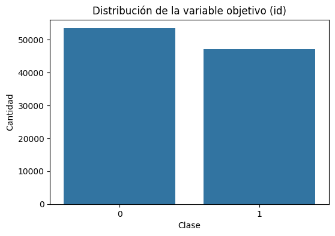

---

## 🔎 Variables Categóricas Relevantes

Se aplicó la **prueba Chi²** para identificar asociación significativa con la variable objetivo (`p < 0.05`).

- **`banca`**  
  Diferencias marcadas entre “Personas”, “Independientes” y “Pyme”.  
  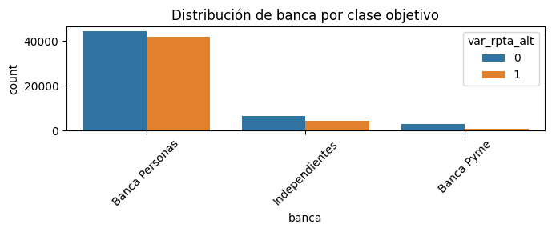

- **`rango_mora`**  
  Clientes con mora de `1-30 días` tienen mayor aceptación.  
  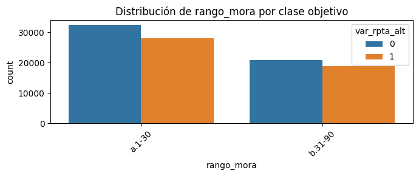

- **`alternativa_aplicada_agr`**  
  Influye fuertemente; destaca `SIN_INFO` con alta clase 0.  
  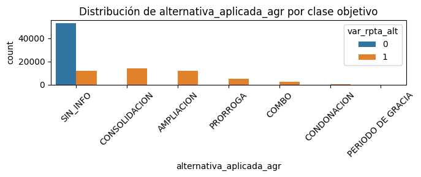

- **`cant_promesas_cumplidas_binario`**  
  Más aceptación en quienes ya cumplieron promesas.  
  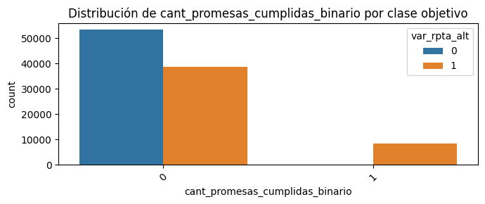

- **`cant_gestiones_binario`**  
  Mayor aceptación con al menos una gestión previa.  
  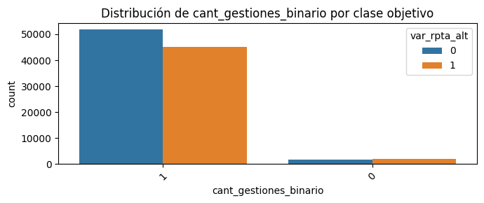

- **`segmento`**  
  Patrones distintos según segmento; “Personal” domina en volumen.  
  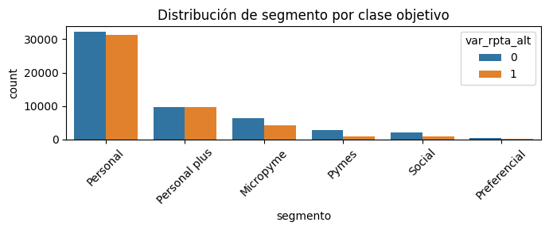

- **`marca_alternativa`**  
  Alta aceptación cuando el cliente ya ha aceptado antes  
  ⚠️ **Posible data leakage**  
  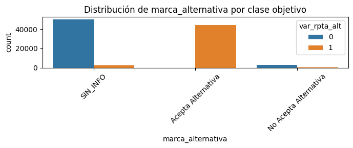

---

## 📈 Variables Numéricas Relevantes

- **`porc_pago_mes`**  
  A mayor proporción pagada, mayor aceptación.  
  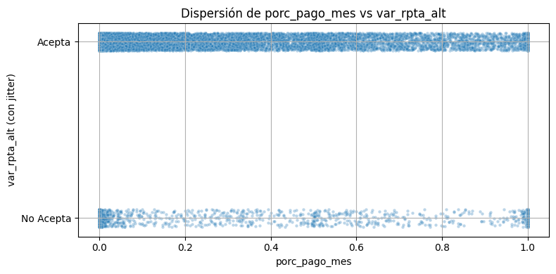

- **`rpc` (realizó pago completo)**  
  Fuerte predictor positivo  
  ⚠️ Evaluar posible fuga de información  
  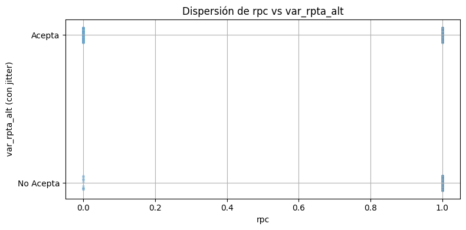

- **`endeudamiento`**  
  Menor endeudamiento → mayor propensión a aceptar.  
  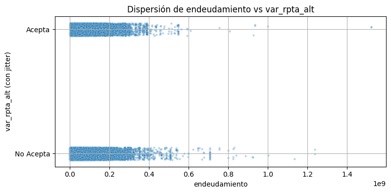

- **`dias_mora_fin`**  
  Menos días en mora → mayor aceptación (comportamiento esperado).  
  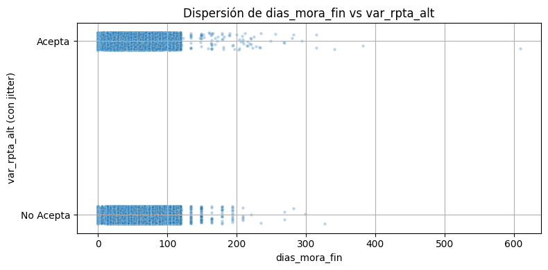

---

## 🔗 Análisis Multivariado

Se calculó la matriz de correlación de Pearson para detectar:

- **Alta colinealidad** entre variables similares:
  - Ej: `valor_cuota_mes` ≈ `valor_cuota_mes_pago`
  - Ej: `saldo_capital` ≈ `vr_obligacion`
- **Relaciones negativas destacadas**:
  - `max_mora` ↔ `prob_propension` (r ≈ -0.83)

Estas correlaciones guiaron la eliminación de variables redundantes en la selección de características.

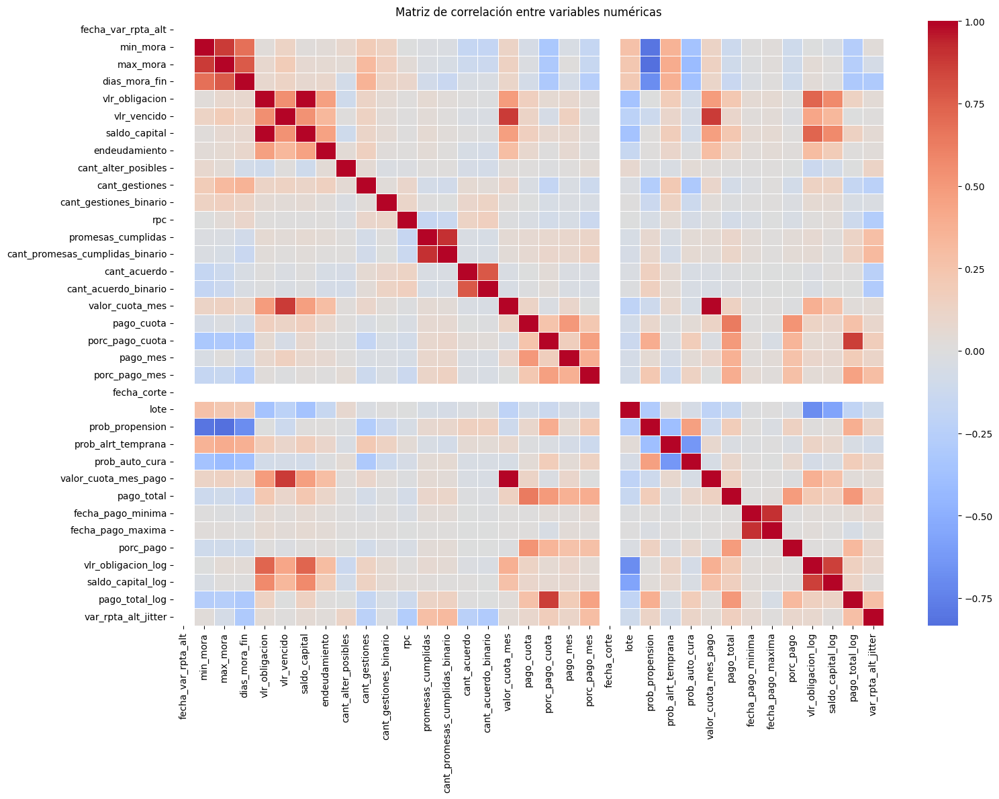

---

> ✅ Este análisis permitió identificar las variables más informativas y detectar posibles riesgos de **fuga de información**, asegurando un set de variables confiables para el modelado.

# 🧪 Selección de Características

El objetivo de esta etapa fue reducir la dimensionalidad y quedarnos únicamente con las variables más informativas, minimizando redundancia y riesgo de sobreajuste.

---

## 1️⃣ Preprocesamiento y Codificación

- Se identificaron variables numéricas y categóricas de baja cardinalidad (≤ 30 categorías).
- Se aplicaron pipelines de transformación con:
  - **Imputación** (`mean` para numéricas, `most_frequent` para categóricas)
  - **Estandarización** (`StandardScaler`)
  - **Codificación** (`OneHotEncoder` con `drop='first'`)

🔹 X shape: (55780, 52)

🔹 X_preprocessed shape: (55780, 145)

---

## 2️⃣ Eliminación de Colinealidad
- Se calculó la matriz de correlación absoluta.
- Se eliminaron variables con correlación > 0.90 respecto a otras.
- Variables eliminadas: 14

 📌 Variables eliminadas por colinealidad: 14

✅ Shape después de quitar colinealidad: (55780, 131)

---

## 3️⃣ Selección con Lasso (L1)
- Se entrenó un modelo LogisticRegression con penalización L1.

- Se conservaron únicamente las variables con coeficientes distintos de cero.

- Variables seleccionadas: 113 de 131

✅ Variables seleccionadas por Lasso: 113 de 131

---

## 📊 Ranking de Importancia
Se ordenaron los coeficientes absolutos del modelo Lasso, y se graficaron las Top 20 variables más relevantes.

Estas variables reflejan fuerte influencia sobre la predicción de aceptación (var_rpta_alt).

✅ Las variables seleccionadas fueron exportadas a [`features.csv`](./data/procesed/features.csv) para ser reutilizadas en la etapa de entrenamiento e inferencia.

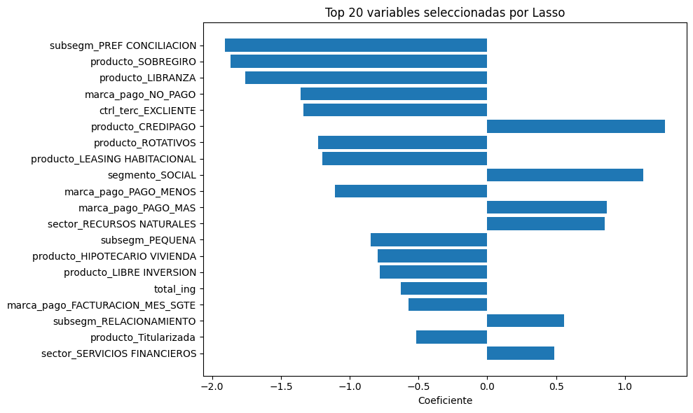

### Interpretación de las Top 5 variables (Lasso)
1. **subsegm_PREF_CONCILIACION**: Clientes de este subsegmento tienen baja probabilidad de aceptación.

2. **producto_SOBREGIRO**: Obligaciones tipo sobregiro se asocian con no aceptación.

3. **producto_LIBRANZA**: Las libranzas presentan menor disposición a aceptar alternativas.

4. **marca_pago_NO_PAGO**: Historial de no pago reduce fuertemente la propensión.

5. **ctrl_terc_EXCLIENTE**: Exclientes tienen baja probabilidad de aceptar opciones de pago.

## 🤖 Selección de Modelo (Model Selection)
Se evaluaron múltiples algoritmos de clasificación para predecir la variable binaria `var_rpta_alt` (acepta o no una opción de pago). El objetivo fue encontrar el modelo con mejor desempeño, validado tanto por métricas estándar como por estabilidad en validación cruzada.

## 🧪 Modelos evaluados
Se compararon cuatro modelos clásicos de clasificación utilizando un split 60/40 y validación cruzada (cv=5):

- LogisticRegression
- KNeighborsClassifier
- DecisionTreeClassifier
- RandomForestClassifier

El proceso se automatizó e integró con MLflow, permitiendo trazabilidad completa de cada experimento: parámetros, métricas y artefactos del modelo.

## ⚙️ Pipeline de evaluación
- Transformación del dataset usando la clase `FeatureSelector`.
- Separación en conjuntos de entrenamiento (60%) y prueba (40%).
- Entrenamiento + validación cruzada para cada modelo.
- Cálculo de métricas: F1 Score, Precision, Recall, Matriz de Confusión, y Classification Report.
- Registro de resultados en MLflow.

## 📊 Resultados

| Modelo                 | F1 Score (test) | Precision | Recall  | F1 CV Mean ± Std |
|------------------------|-----------------|-----------|---------|------------------|
| Logistic Regression     | 0.5816          | 0.7297    | 0.7297  | 0.5799 ± 0.0062  |
| K-Nearest Neighbors     | 0.5306          | 0.6976    | 0.6976  | 0.5228 ± 0.0054  |
| Decision Tree           | 0.5482          | 0.6874    | 0.6874  | 0.5488 ± 0.0058  |
| Random Forest           | 0.6193          | 0.7610    | 0.7610  | 0.6116 ± 0.0101  |

✅ El mejor modelo fue **Random Forest**, con un F1 score de 0.6193, superando a los demás en todas las métricas clave.

## 🛠️ Ajuste de Hiperparámetros
Se realizó una búsqueda exhaustiva con GridSearchCV sobre los siguientes hiperparámetros del modelo Random Forest:

- `n_estimators`: [100, 200]
- `max_depth`: [5, 10]
- `min_samples_split`: [2, 5]
- `min_samples_leaf`: [1, 2, 5]
- `max_features`: ['sqrt', 'log2']

Se evaluaron 72 combinaciones, utilizando validación cruzada con `scoring='f1'`.

### ✅ Mejor configuración encontrada
- `max_depth`: 10  
- `max_features`: 'sqrt'  
- `min_samples_leaf`: 2  
- `min_samples_split`: 2  
- `n_estimators`: 200  

## 📈 Métricas del mejor modelo (RandomForest + Hyperparameter Optimization (HPO))

| Métrica     | Valor  |
|-------------|--------|
| F1 Score    | 0.5835 |
| Precision   | 0.7116 |
| Recall      | 0.4944 |
| Accuracy    | 0.76   |

> 📁 Todos los modelos, métricas y artefactos fueron registrados y gestionados mediante **MLflow**, lo que facilita su trazabilidad y posterior despliegue.

## 🚀 Despliegue e Inferencia

El modelo entrenado fue empaquetado y desplegado usando una arquitectura sencilla pero efectiva que permite su **consumo vía API REST** y a través de una **interfaz web interactiva con Streamlit**.

## 🧠 API de Predicción (FastAPI)

Se construyó una API en **FastAPI** que permite generar predicciones cargando un archivo `.csv` o especificando una ruta local. La API expone el siguiente endpoint:

### POST `/predecir`

Permite:

- Seleccionar el modelo deseado (por nombre).
- Cargar un archivo OOT directamente o especificar la ruta en disco.
- Retornar automáticamente un archivo `submission.csv` con los resultados.

La lógica está encapsulada en una clase `Predictor`, que recibe el modelo, ejecuta el preprocesamiento y guarda el archivo listo para subir como sumisión.

---

## 🖥️ Interfaz de Usuario (Streamlit)

Se creó una interfaz web con **Streamlit** que permite:

- Subir un archivo `.csv`.
- Seleccionar el modelo entrenado.
- Enviar la solicitud a la API.
- Descargar el archivo con los resultados.

Esto permite que cualquier persona del negocio o del equipo de riesgo pueda generar predicciones sin necesidad de conocimientos técnicos.

---

## 🐳 Contenerización con Docker

Para facilitar la ejecución del sistema completo en cualquier entorno, se construyeron dos imágenes Docker:

### API (FastAPI): definida en `Dockerfile`

- Expone el puerto `8000`.
- Ejecuta la API con `uvicorn`.

### App (Streamlit): definida en `dockerfile.streamlit`

- Expone el puerto `8501`.
- Permite levantar la interfaz gráfica vía navegador.

Ambos servicios se pueden orquestar fácilmente usando `docker-compose`, facilitando el despliegue local o en servidores remotos.

# ▶️ Ejecución Local

A continuación se describen los pasos para levantar el sistema de predicción de forma local, sin usar Docker.

---

### 🔹 1️⃣ Levantar sin Docker

1. **Clonar el repositorio**:

*git clone https://github.com/juanguzman2/prueba_tecnica_MELI.git*

2. **Crear un entorno virtual y activar**:

Cerciorarse de que se está en la carpeta base:

- *cd juan_guzman_prueba*

Crear el entorno virtual:

- *python -m venv env*

Activar el entorno virtual:

- *.\env\Scripts\activate*   (En Windows)

3. **Instalar dependencias**

*pip install -r requirements.txt*

4. **Ejecutar la API con FastAPI**

*uvicorn src.api:app --host 127.0.0.1 --port 8000 --reload*

5. **Ejecutar la interfaz en Streamlit**

Abrir otra terminal y asegurarse de estar en la carpeta principal:

- *cd juan_guzman_prueba*

Activar el entorno virtual:

- *.\env\Scripts\activate*   (En Windows)

Levantar la app:

- *streamlit run webapp/app.py*

---

* Acceder a la API: http://localhost:8000/
* Acceder a la documentación de la API: http://localhost:8000/docs
* Acceder a la interfaz gráfica (Streamlit): http://localhost:8501/

# ✅ Conclusiones Generales del Proyecto

1. Se desarrolló una solución analítica E2E robusta para predecir la aceptación de opciones de pago por parte de clientes en mora, alineada con las necesidades estratégicas de Bancolombia.

2. El modelo final, basado en Random Forest y ajustado con GridSearchCV, obtuvo métricas sólidas (F1: 0.58, Precision: 0.71) sobre un conjunto de prueba realista (OOT enero 2024), y fue registrado con trazabilidad completa en MLflow.

3. Se aplicaron buenas prácticas de ingeniería de datos, como imputación, codificación, escalamiento, eliminación de colinealidad y selección con Lasso, resultando en un conjunto de 113 variables relevantes.

4. La solución es modular y productizable, con:

  *  API REST en FastAPI para consumo automatizado.

  *  Interfaz Streamlit para usuarios del negocio.

  * Contenerización completa con Docker.

5. El modelo es interpretativo y arroja insights valiosos sobre segmentos, productos y comportamientos que influyen en la propensión a aceptar opciones de pago, facilitando decisiones tácticas de cobranza.

6. El diseño permite escalar hacia arquitecturas más complejas de MLOps, incluyendo monitoreo, versionado de modelos y automatización del retraining.

7. `Se recomienda que, bajo la arquitectura actual de Bancolombia, todo el almacenamiento de datos se realice a través de la Landing Zone (LZ), asegurando gobernabilidad, trazabilidad y cumplimiento con los lineamientos institucionales de datos.`

8. `Para el control de versiones y gestión colaborativa del código y modelos, se sugiere utilizar repositorios en Azure DevOps, lo que permite auditar cambios, integrar flujos CI/CD y escalar la solución dentro de prácticas de MLOps.`

# Propuesta Funcional: Interfaz Conversacional para el Proyecto de Predicción de Aceptación de Opciones de Pago – Bancolombia

## 🧠 Objetivo de la Interfaz Conversacional

Permitir que usuarios no técnicos interactúen de forma natural con el sistema analítico, accediendo a insights del modelo de predicción y la información histórica del cliente, sin necesidad de escribir consultas complejas o manejar bases de datos directamente.

---

## 🔍 ¿Qué permitiría hacer esta interfaz?

### 1. Consultar Predicciones Individuales
**Ejemplo:**  
> “¿Qué probabilidad tiene Juan Pérez de aceptar una opción de pago este mes?”

**Funcionalidad:**  
La interfaz devuelve la probabilidad calculada por el modelo, el score, y las variables más influyentes en su predicción (explainability).

---

### 2. Explorar Segmentos de Clientes
**Ejemplo:**  
> “Muéstrame los clientes con alta probabilidad de aceptar el plan de pago pero que aún no han sido contactados.”

**Funcionalidad:**  
Devuelve un segmento filtrado dinámicamente con insights accionables.

---

### 3. Revisar la Historia del Cliente
**Ejemplo:**  
> “¿Qué pagos ha hecho el cliente 12345 en los últimos 6 meses?”

**Funcionalidad:**  
Consulta cruzada con los datos de pagos históricos, cuotas, comportamiento.

---

### 4. Simular Escenarios
**Ejemplo:**  
> “¿Qué pasaría si al cliente X se le ofrece una opción con menor cuota?”

**Funcionalidad:**  
Permite simular el cambio de algunas variables y obtener una nueva predicción (tipo “what-if”).

## 💡 Casos de uso específicos en contexto Bancolombia

- **Gestores de cobranza**: pueden consultar el perfil de un cliente y recibir recomendaciones sobre cómo abordarlo según la probabilidad de aceptación y su historial.
- **Área de inteligencia comercial**: puede explorar segmentos de clientes para definir campañas proactivas.
- **Analistas de riesgo**: pueden evaluar el impacto de nuevas variables.

---